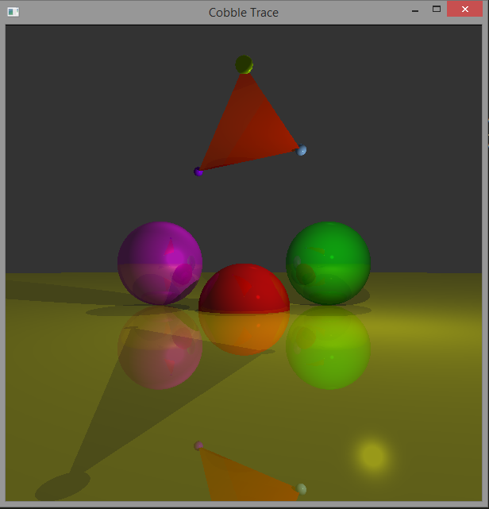

# Cobble Trace

This is primarily a port of the raytracer from "Computer Graphics from Scratch"
to C and SDL.
 https://www.gabrielgambetta.com/computer-graphics-from-scratch/

It is named Cobble Trace since I cobbled together information form a few 
different locations:

Threading code is basically Boss/Worker from:
http://birrell.org/andrew/papers/035-Threads.pdf

Triangle code is based on Glassner's Ray Tracing book, Scratch A Pixel and UC Davis Ray Tracing lectures:
- https://www.scratchapixel.com/lessons/3d-basic-rendering/ray-tracing-rendering-a-triangle/barycentric-coordinates
- https://www.youtube.com/watch?v=Ahp6LDQnK4Y
- https://archive.org/details/AnIntroductionToRayTracing_201902

## Windows Build
- Place this repo in %USERPROFILE%/src/CobbleTrace
- Place SDL2 library directory in a subfolder CobbleTrace/SDL
- Place the SDL.dll in the CobbleTrace directory
- In a shell with vcvarsall.bat loaded run build.bat

## Linux Build
- Install libsdl2-dev
- Run build.sh

## Environment and versions
Tested on:
- Windows 8 (cl version 19.28.29914)
- Windows 10 (cl version 19.28.29915)
- Xubuntu 20.04.3 (Linux version 5.13.0-30-generic) (gcc version 9.4.0)
- SDL2-2.0.22 x64

## TODO List
See the top of raythread.cpp 